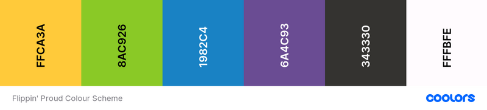
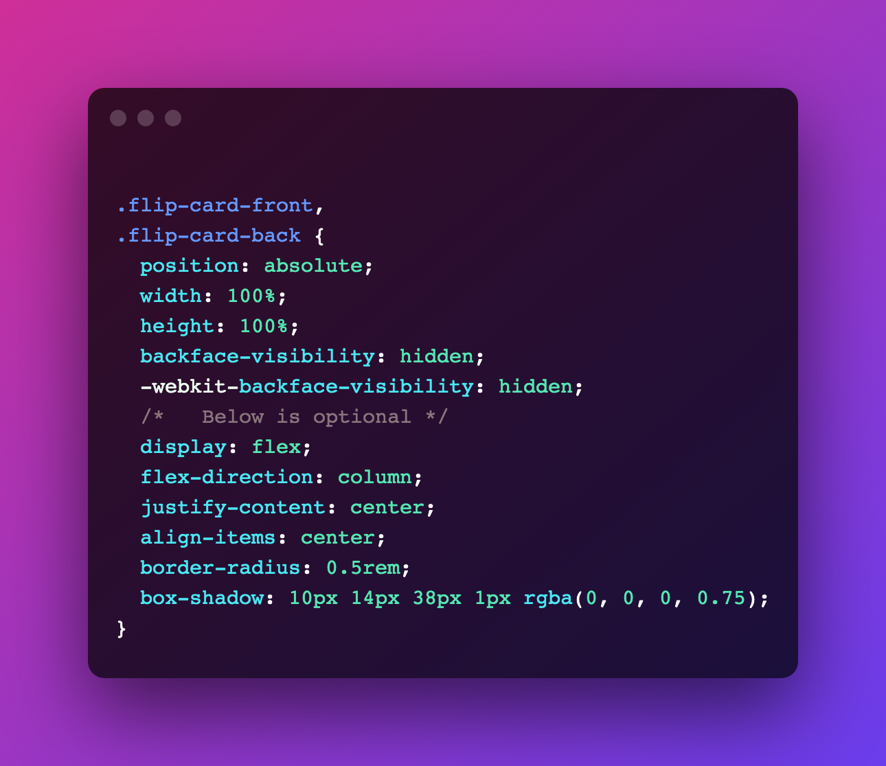

<p align="center"></p>

<p align="center"></p>

<h1 align='center'>Flippin' Proud</h1>

<p align="center"></p>

<h3 align="center"><a href="https://loosenthedark.github.io/flippin-proud/">Live link to deployed project</a> (hosted on GitHub Pages) | <a href="http://loosenthedark.tech/flippin-proud/">Alternative link</a> (hosted on loosenthedark.tech)</h3>

## What's It All About?

[**Flippin' Proud**](https://loosenthedark.github.io/flippin-proud/) is a collaborative team project initally developed and submitted as part of [Code Institute](https://codeinstitute.net/)’s [#ProudCoders June 2021 Hackathon](https://hackathon.codeinstitute.net/hackathon/8/). The application's primary function is to celebrate Pride month and its themes of diversity, visibility and community. More specifically, the programmers set out to help educate and bring people together by showcasing a selection of pioneering LGBTQ+ figures both past and present, as well as the roles they have played in furthering the cause of equality and inclusivity. The efforts and bravery of these icons has helped combat ignorance and intolerance across the globe, and laid the foundations for others to come forward and work towards a brighter future. 

Users can interact with flipcards of the aforementioned figures by clicking on the respective image (on the front of each flipcard) to flip the card over and view background information highlighting the importance of that individual to the LGBTQ+ community.

The project has been made possible thanks to the hard work and collaboration of the following team of developers:

 - [John Doyle](https://github.com/Aramantos)
 - [Christine Greaney-Kelley](https://github.com/christine-gk416)
 - [Paul Harrington](https://github.com/loosenthedark)
 - [Steven Kenny](https://github.com/SteveKennyUK)
 - [Adrian Looney](https://github.com/Jammerref2015)

## User Experience (UX)

This website adheres to the principles of User-Centred Design (UCD), which focuses on placing users at the centre of the design and development process.

### User Stories:

#### User Goals (general visitor to the site):

 - "As a user, I want to be able to engage with the site intuitively and understand its main purpose immediately."
 - "As a user, I want to be able to easily identify what I need and navigate the site in order to get to it."
 - "As a user, I want to be able to access concise but informative content that's displayed in an aesthetically pleasing manner."
 - "As a user, I want to be able to view the site clearly and responsively across a range of different devices (from mobile to desktop)."
 - "As a user, I expect the site to conform to current UX accessibility best practices."

#### Developer Goals:

 - "As a developer, I want to contribute to a spirit of open-source collaboration and teamwork while enhancing my own communication and problem-solving skills."
 - "As a developer, I want to learn new programming skills and increase my knowledge of various languages, frameworks and libraries."
 - "As a developer, I want to learn how to use version control within a sprint-based team project environment."
 - "As a developer, I would like to produce a fully responsive application to add to my portfolio of work and showcase to potential employers."

### Project Design:

#### Colour Scheme:

It was important to use a bright colour scheme, broadly similiar to the colours of the [rainbow flag](https://en.wikipedia.org/wiki/Rainbow_flag_(LGBT)) that is so synonymous with Pride and the LGBTQ+ community. This both reinforces the subject matter of the site and generates a welcoming and inclusive atmosphere for the visitor.
	
The following colour scheme was decided upon after following guidance from the [Coolors](https://coolors.co/ffca3a-8ac926-1982c4-6a4c93-343330-fffbfe) website:

<p align="center"></p>

#### Typography:

**[Montserrat](https://fonts.google.com/specimen/Montserrat)** was selected as the primary font to be used for all headings throughout the site. It is a clean, legible (important for accessibility purposes) and widely-used font that's featured on many existing websites with an LGBTQ+ theme. **[Roboto](https://fonts.google.com/specimen/Roboto)** was subsequently chosen as Flippin' Proud's secondary font, as [this pairs well with Montserrat](https://typ.io/fonts/montserrat). A generic **sans-serif** designation acts as a fallback in case the chosen fonts specified above are not imported correctly.

#### Wireframes:

Wireframes for the project can be found [here](docs/wireframes/flippin-proud-wireframes.pdf)

## Features

### Existing Features:
- The site consists of three pages (as well as a custom error page), each with a full-width responsive **navigation bar** fixed to the top of the viewport:
  - A **jumbotron** greets users on the [main landing (Home) page](https://loosenthedark.github.io/flippin-proud/), with some introductory content on the theme and purpose of the site followed by a bright **call to action button** to take the user to the main flipcard page.
  - The central [Flipcards page](https://loosenthedark.github.io/flippin-proud/flipcards) offers an interactive invitation to the user to learn about the important contributions made by various individuals to the LGBTQ+ community.
  - A final [Contact page](https://loosenthedark.github.io/flippin-proud/contact) features a list of relevant information and contact links for each of the site's developers.

## Technologies Used

### Languages:

- [HTML5:](https://en.wikipedia.org/wiki/HTML5) used for structuring the site
- [CSS3:](https://en.wikipedia.org/wiki/Cascading_Style_Sheets) used for styling the site
- [JavaScript:](https://en.wikipedia.org/wiki/JavaScript) used for site logic and web page behaviour
    
### Frameworks, Libraries, Programmes, File Formats and Tools:

- [Bootstrap v4.6.0:](https://getbootstrap.com/docs/4.6/getting-started/introduction/) used to assist with the responsiveness and layout of the website
- [Hover.css v2.3.1:](https://ianlunn.github.io/Hover/) used to add dynamic hover effects to buttons and icons
- [Google Fonts:](https://fonts.google.com/) used to import the Roboto and Montserrat fonts into the `style.css` stylesheet that's used throughout the project
- [Font Awesome v5.15.3:](https://fontawesome.com/): used to add appropriate and visually appealing site icons
- [jQuery v3.5.1:](https://jquery.com/) used to assist with manipulation of the Document Object Model (DOM) that facilitates interactivity
- [JSON:](https://en.wikipedia.org/wiki/JSON) used to store and transport data
- [Git:](https://git-scm.com/) used for version control by utilising the Gitpod terminal to commit frequently to Git and push all commits to GitHub
- [GitHub:](https://github.com/) used to compile and remotely store the project's codebase following successive local commits and pull requests initiated from the command line
- [Balsamiq:](https://balsamiq.com/) used to generate [wireframes](docs/wireframes/flippin-proud-wireframes.pdf) during the project's design phase
- [Adobe Photoshop:](https://www.adobe.com/uk/products/photoshop.html): used to create the website's main [`.navbar-brand` logo](static/images/logo-final.png)
- [favicon.io (favicon generator):](https://favicon.io/favicon-converter/) used to create a favicon boasting full cross-browser compatibility
- [WebAIM (contrast checker):](https://webaim.org/resources/contrastchecker/) used to ensure site foreground and background colour contrasts meet [WCAG 2 accessibility requirements](https://webaim.org/articles/contrast/)
- [Web Formatter:](https://webformatter.com) used to assist in optimising code readability
- [Autoprefixer:](https://autoprefixer.github.io/) used to parse CSS and apply all necessary vendor prefixes
- [TinyPNG:](https://tinypng.com/) used for image compression
- [PicResize:](https://picresize.com/) used to crop and resize images
- [Ray.so:](https://ray.so/) used to create the code block image featured in the [**Bugs** subsection](#bugs) of the **Testing** section of this Markdown file

## Testing

### Validation:

- [W3C](https://www.w3.org/)'s [Markup Validation Service](https://validator.w3.org/) was used to test the validity of all HTML used in this project. The code was [validated by direct input](https://validator.w3.org/#validate_by_input), and all suggested corrections were then made. As a result, all of the site's HTML files now return a _"Document checking completed. No errors or warnings to show."_ message upon being passed through this validator.
- Likewise, the website's custom CSS stylesheets were each checked for errors using [W3C](https://www.w3.org/)'s [CSS Validation Service](https://jigsaw.w3.org/css-validator/). Once again, [validation by direct input](https://jigsaw.w3.org/css-validator/#validate_by_input) was the preferred method selected, and all necessary changes were subsequently carried out. Consequently, the stylesheets all now return a _"Congratulations! No error found."_ message upon being passed through this validator.
- In a similar manner, the site's custom JavaScript code was validated against [JSHint](https://jshint.com/)'s online JS error-detection tool.

### Responsiveness:

- [Chrome DevTools](https://developer.chrome.com/docs/devtools/) and real devices of various sizes and screen widths belonging to the developers were used extensively to test responsiveness throughout the project's evolution.

### <a name="bugs"></a> Bugs:

- The programmers encountered a specific bug relating to [iOS](https://en.wikipedia.org/wiki/IOS) devices when viewing and interacting with the `flipcards.html` page. Rather than revealing the text on the back of each card (as intended) when flipped, the cards initially simply showed a mirror image of the photo used on the card's front. [This video](https://user-images.githubusercontent.com/48750933/123703440-46b83400-d85c-11eb-87d1-936a6246ba3f.mp4) gives a realistic demonstration of the bug before it was addressed by the developers during the project's testing phase.
- Following considerable troubleshooting and attempts at collaborative problem-solving, a fix for this bug was arrived at in the form of the `-webkit-backface-visibility: hidden` CSS declaration. More specifically, the [prefixed version](https://css-tricks.com/almanac/properties/b/backface-visibility/#prefixes) of this declaration was required for both the front and back of each flipcard in order for the functionality to work correctly on iOS - see the code block below for an illustration of the full CSS rule that was ultimately (successfully) applied to these elements:

<p align="center"></p>


## Deployment

### GitHub Pages:

This project has been deployed to [GitHub Pages](https://en.wikipedia.org/wiki/GitHub#GitHub_Pages). The deployment process carried out was as follows...

1. [**Sign in** to GitHub](https://github.com/login) and locate the [relevant repository](https://github.com/loosenthedark/flippin-proud). If you do not have a GitHub account, you may create one [here](https://github.com/signup).
2. At the top of the project repository page, select **Settings**. 
3. On the Settings page, scroll down the menu on the left-hand side and select **Pages** near the bottom of the menu.

This will open GitHub pages....

4. Under **Source**, click the dropdown titled **None** and select the **master** branch. Click **Save**. 
5. The page will automatically refresh and inform you that the site is now ready to be published, as well as providing the `https://` address to be used. 
6. A [link](https://loosenthedark.github.io/flippin-proud/) to the newly-published site can be found in the GitHub **Pages** section of **Settings**.

### Forking the GitHub Repository:

It is possible to fork this GitHub repository and make a copy of the original repository to view and/or make changes without affecting the original. This is achieved by following these steps...

1. [Sign in to your GitHub account](https://github.com/login) and locate the [relevant repository](https://github.com/loosenthedark/flippin-proud).
2. Click on **Fork**, located near the top right-hand corner of the repository page.
3. You will now have a copy of this project's repository in your own GitHub account.

### Making a Local Clone:

It is possible to copy the repository to your local machine so that you can fix merge conflicts, add or remove files and push larger commits without affecting the original repository. Cloning a repository pulls down a full copy of all the repository data that GitHub has at that point in time. See [GitHub Docs](https://docs.github.com/en/github/creating-cloning-and-archiving-repositories/cloning-a-repository) for further information, and below for a brief summary...

1. [Sign in to your GitHub account](https://github.com/login) and locate the [relevant repository](https://github.com/loosenthedark/flippin-proud).
2. Click on the **Code** button next to the green **Gitpod** button. This will reveal the **Clone** option.
3. In order to clone the repository using `HTTPS`, select **HTTPS** and copy the link. There is a copy button to the right of the URL.
4. Next, open **Git Bash**. See [here](https://git-scm.com/downloads) for an overview of download options, if required.
5. Change the current working directory on your local machine to the location where you want the cloned directory to be made.
6. Type `git clone` into your IDE terminal followed by the URL you copied in Step 3 above:

```
https://github.com/loosenthedark/flippin-proud.git
```

7. Press **Enter**. 
8. Your local clone will be created.

See [GitHub Docs](https://docs.github.com/en/github/creating-cloning-and-archiving-repositories) for more information on all of the above processes.

## Credits

### Code:

- [Bootstrap v4.6.0](https://getbootstrap.com/docs/4.6/getting-started/introduction/) components, utilities and style classes were used extensively throughout the project, chiefly to make the site responsive in accordance with the [Bootstrap grid system](https://getbootstrap.com/docs/4.0/layout/grid/).
- Base code for the site's animated sparkle effects was provided by [Simon Goellner](repo: https://github.com/simeydotme/jQuery-canvas-sparkles | demo: http://simeydotme.github.io/jQuery-canvas-sparkles/) and adapted by the developers.
- Guidance on how to implement [vertical scroll snapping](https://css-tricks.com/practical-css-scroll-snapping/) between flipcards on mobile devices using pure CSS (i.e. no JS) was obtained from [this Dev Ed video tutorial](https://www.youtube.com/watch?v=htw4iKMYzEc)

### Content:

Card content courtesy of [Wikipedia](https://en.wikipedia.org/wiki/Main_Page) and [Bi.org](https://bi.org/en)

### Media:

The images used to populate the cards originate from the following sources... 

- Panti Bliss courtesy of [Conor Horgan](http://www.conorhorgan.com/) via [Wikipedia](https://en.wikipedia.org/wiki/Panti)
- Lynn Conway courtesy of [The New York Times](https://www.nytimes.com/2020/11/21/business/lynn-conway-ibm-transgender.html)
- Tim Cook courtesy of [Austin Community College](https://www.flickr.com/photos/accdistrict/35992738453/) via [Wikipedia](https://en.wikipedia.org/wiki/Tim_Cook#/media/File:Tim_Cook_%282017,_cropped%29.jpg)
- Emma Donoghue courtesy of [The Irish Times](https://www.irishtimes.com/culture/books/emma-donoghue-it-feels-very-odd-to-be-benefiting-from-the-crisis-1.4299127)
- Billie Holiday courtesy of [Bill Spilka](https://www.popartphotoshow.com/artists/bill-spilka/)/[Getty Images](https://www.gettyimages.co.uk/detail/news-photo/jazz-and-blues-singer-billie-holiday-performs-at-the-news-photo/167855118?adppopup=true) 
- Ian McKellen courtesy of [Gage Skidmore](https://www.flickr.com/people/gageskidmore/) via [Wikipedia](https://en.wikipedia.org/wiki/Ian_McKellen#/media/File:SDCC13_-_Ian_McKellen.jpg)
- David Norris courtesy of [Wikipedia (source unknown)](https://en.wikipedia.org/wiki/David_Norris_%28politician%29)
- Elliot Page courtesy of [Rich Polk](http://richpolk.com/ll2zy7a1hcrj17f16wrab8udsjyy5g)/[Getty Images](https://www.gettyimages.co.uk/detail/news-photo/ellen-page-attends-the-imdb-studio-presented-by-intuit-news-photo/1172973866?adppopup=true) for [IMDb](https://www.imdb.com/)
- Megan Rapinoe courtesy of [Lorie Shaull](https://www.flickr.com/people/11020019@N04) via [Wikipedia](https://en.wikipedia.org/wiki/Megan_Rapinoe#/media/File:Megan_Rapinoe_%2848675274817%29_%28cropped%29.jpg)
- Gareth Thomas courtesy of [UK Home Office](https://www.flickr.com/people/49956354@N04) via [Wikipedia](https://en.wikipedia.org/wiki/Gareth_Thomas_%28rugby%29#/media/File:Gareth_Thomas_%28rugby_player%29.jpg)
- Alan Turing courtesy of [The Turing Digital Archive](http://www.turingarchive.org/viewer/?id=521&title=4) via [Wikipedia](https://en.wikipedia.org/wiki/Alan_Turing#/media/File:Alan_Turing_Aged_16.jpg)
- Oscar Wilde courtesy of [Napoleon Sarony](https://en.wikipedia.org/wiki/Napoleon_Sarony) via [Wikipedia](https://en.wikipedia.org/wiki/Oscar_Wilde#/media/File:Oscar_Wilde_3g07095u-adjust.jpg)

### Acknowledgements:

The team would like to thank their mentor [Aukje van der Wal](https://github.com/byIlsa) for her amazing support, guidance and humour throughout the entire project.

### Notice:

This site has been created for educational purposes only.
